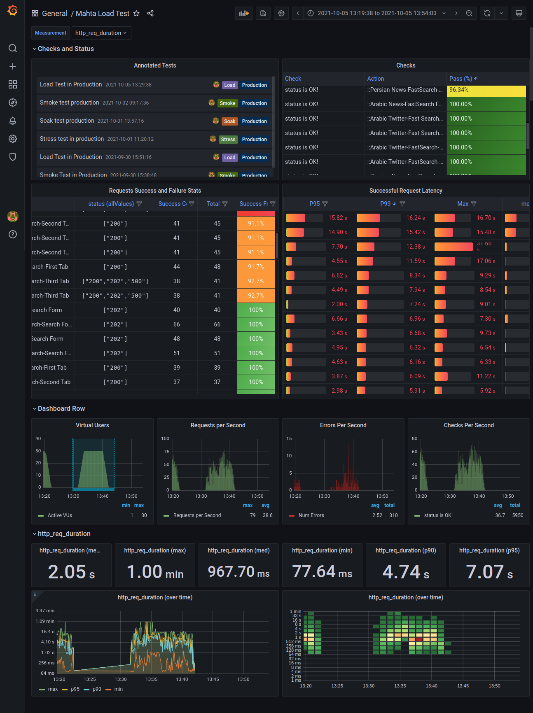
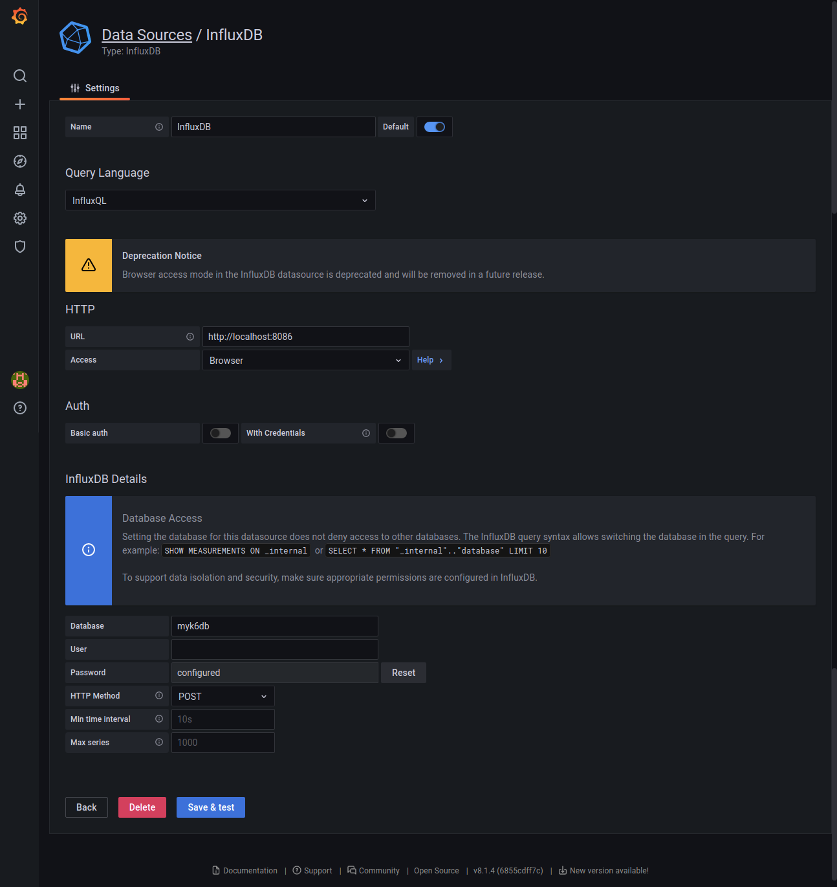

# K6 Load Test Example 


## Prerequisites

- npm
- python 3.6+
- Docker

## Installation


## Run the test

1. Clone the repository

2. change directory to files:

install k6
https://k6.io/docs/get-started/installation/ 


Run k6 with the desired test mode. Wait for the test to get accomplished.

```shell
k6 run -e test_mode=smoke -e config_env=qa src/test/smartplugswitch.js
```

Run k6 with output html report

```shell
K6_WEB_DASHBOARD=true K6_WEB_DASHBOARD_HOST=localhost K6_WEB_DASHBOARD_PORT=5665 K6_WEB_DASHBOARD_EXPORT=report/html-report.html k6 run -e test_mode=smoke -e config_env=qa src/test/smartplugswitch.js
```

Run k6 with output html and influx report

```shell
K6_WEB_DASHBOARD=true K6_WEB_DASHBOARD_HOST=localhost K6_WEB_DASHBOARD_PORT=5665 K6_WEB_DASHBOARD_EXPORT=report/html-report.html k6 run -e test_mode=smoke -e config_env=qa --out influxdb=http://localhost:8086/smarthomedb src/test/smartplugswitch.js
```

You can choose the *test_mode* value according to the below options.

- **smoke**: Targets the functionality of the system under the lowest load: Is it working with only one user?

- **load**: Targets the system under normal usage by the users. You should ask: How many users are using the system simultaneously typically and how long is their session?

- **stress**: What is the maximum capacity of the system? How many users with what kind of behavior should use the site to disrate its quality due to the SLO: i.e. availability, request latency, throughput and etc.

- **soak**: Would the system last for a long time(normally hours to days) under normal conditions? It’s working for 15min under normal condition in the load test but is feasible for a much longer time?

3. Now you can get back to the imported [grafana dashboard](http://localhost:3000) and see the results.



## Running k6 with Docker

You can use the k6 official docker image to run the tests. This is a practical approach specially for CI/CD purposes like run the tests with cronjob. The Dockerfile in the root of the repository will do that for you. Furthermore, you can use it in docker-compose along with other containers by commenting out the *k6-tester* service.

### Setup Influx and Grafana

1. Up the `docker-compose.yaml` file with:

```shell
docker-compose -f docker-compose.yaml up
```

You should be able to see Grafana dashboard on http://localhost:3000

Its default username and password is: `admin`

2.  Create a data source with below configurations:



2.  Import the pre-configured Exa dashboard by id: `15080` or by the [link](https://grafana.com/grafana/dashboards/15080)

Now everything is ready to get the test.

